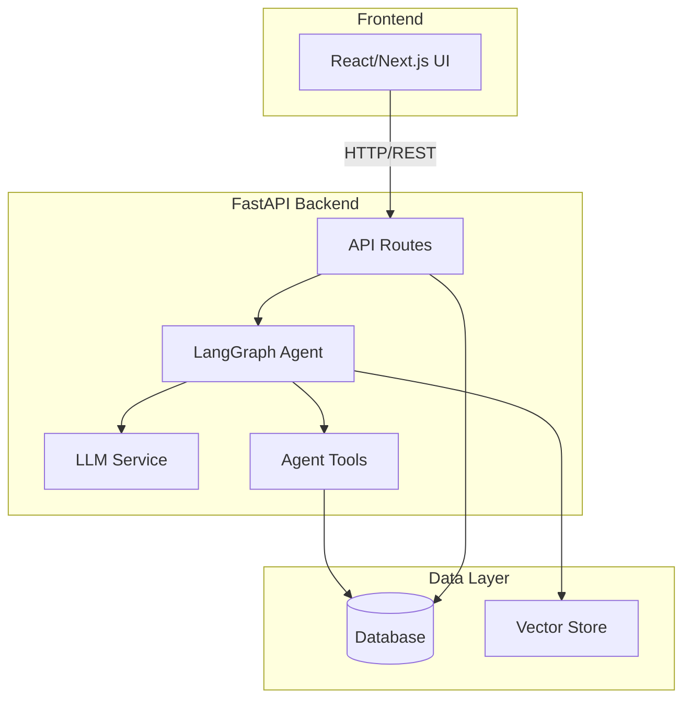
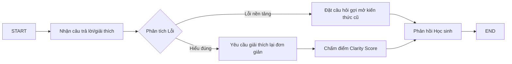
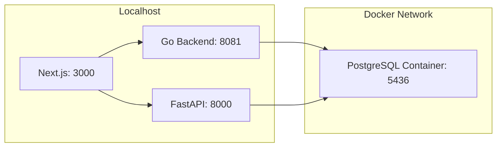

# Architecture Document

## System Overview

Aurora Assistant là một hệ thống gia sư AI cá nhân hóa dành cho lớp học đông học sinh, áp dụng triết lý phản biện và tư duy sâu (Socratic, Feynman, First Principles). Kiến trúc hệ thống bao gồm 3 phân hệ chính: Frontend (Next.js) phục vụ giao diện học sinh/giáo viên, Backend (Go) xử lý logic nghiệp vụ và dữ liệu, và AI Assistant API (Python/FastAPI) phụ trách điều phối các luồng Agent bằng LangGraph và Gemini API.

## Architecture Diagram

## Components

### 1. Frontend (React/Next.js)
- **Purpose:** Cung cấp trải nghiệm học tập tương tác cho học sinh và Dashboard quản lý cho giáo viên.
- **Key Features:**
  - Phòng Chat Phản Biện Socratic.
  - Tập Vở Feynman (tích hợp Vocabulary Analyzer và Clarity Score).
  - Bản đồ Nguyên lý (First Principles Canvas).
  - Teacher Dashboard (Biểu đồ lỗ hổng, Cảnh báo học sinh, Ngăn kéo kiểm duyệt).
  - Chế độ Offline Mode & Batch Sync.
- **State Management:** React Hooks, Context API, lưu trữ LocalStorage cho chế độ ngoại tuyến.

### 2. Backend (Go)
- **Purpose:** Đóng vai trò làm máy chủ trung tâm quản lý tài khoản, phiên học, đồng bộ dữ liệu ngoại tuyến và lưu trữ kết quả.
- **API Design:** RESTful API với Fiber v3.
- **Authentication:** JWT (JSON Web Tokens).

### 3. AI Agent (FastAPI & LangGraph)
- **Agent Type:** Custom Orchestration kết hợp Graph-based State Machine (LangGraph).
- **State:** Lưu trữ context hội thoại, mức độ thấu hiểu (Clarity Score), và lỗ hổng kiến thức hiện tại.
- **Nodes:**
  - *Socratic Node:* Đặt câu hỏi gợi mở, chẩn đoán lỗi.
  - *Feynman Node:* Lắng nghe học sinh giảng lại, đánh giá Clarity Score.
  - *Knowledge Graph Node:* Truy xuất các chân lý gốc.
- **Tools:** Vocabulary Analyzer, Concept Gap Detector.
- **Flow:**

### 4. Database
- **Type:** PostgreSQL
- **Tables:** Users (Học sinh/Giáo viên), Sessions, Chat Logs, Concept Gaps, Mastery Matrix.
- **Migrations:** GORM AutoMigration (chạy tự động khi khởi động Go Backend).

### 5. Vector Store / Knowledge Graph
- **Type:** Local JSON / In-memory Knowledge Graphs (Lưu trữ các sơ đồ kiến thức từ Lớp 1-12).
- **Embeddings:** (Được tích hợp qua Gemini API nếu cần tra cứu ngữ nghĩa).
- **Purpose:** Cung cấp dữ liệu gốc (Axioms) cho tính năng "Bản đồ Nguyên lý" và hỗ trợ AI chẩn đoán.

## Data Flow

1. **Giao tiếp Frontend - Backend:** Học sinh tương tác trên giao diện Next.js (có thể lưu tạm Offline nếu rớt mạng).
2. **Xử lý Dữ liệu:** Khi có mạng, Frontend đồng bộ dữ liệu qua API Go (Fiber) để lưu trữ vào PostgreSQL.
3. **Phân tích AI:** Các request đòi hỏi tư duy hoặc chẩn đoán (Chat Socratic, chấm điểm Feynman) được gửi sang Python FastAPI.
4. **LangGraph Pipeline:** Agent chia nhỏ vấn đề, gọi Gemini API để phân tích ngữ nghĩa và sinh câu hỏi phản biện.
5. **Cập nhật Trạng thái:** Kết quả đánh giá lỗ hổng được lưu ngược lại DB, giúp cập nhật biểu đồ Teacher Dashboard.
6. **Phản hồi:** Trả về giao diện cho học sinh.

## Deployment Architecture

## Security

- API keys (Google Gemini) lưu trong `.env` (không bao giờ commit).
- Quản lý phiên bằng JWT tokens an toàn.
- Kiến trúc tách biệt: Go quản lý Auth/Dữ liệu cứng, Python xử lý mô hình AI.
- Chế độ Offline Sync được mã hóa và xác thực khi đẩy batch lên server.

## Design Decisions

| Decision | Choice | Reason |
|----------|--------|--------|
| Frontend Framework | Next.js + Tailwind | Render nhanh, UI/UX mượt mà, hỗ trợ tốt cho phát triển components động (Canvas, Chat). |
| Core Backend | Go (Fiber v3) | Hiệu năng cực cao, nhẹ, phù hợp làm API Gateway và quản lý I/O DB đồng bộ lớn. |
| AI Backend | Python (FastAPI + LangGraph) | Hệ sinh thái AI/LLM mạnh nhất, dễ dàng xây dựng luồng tư duy Agent phức tạp. |
| Database | PostgreSQL | Đảm bảo tính toàn vẹn dữ liệu cho thông tin học sinh, hỗ trợ JSONB cho logs. |
| AI Model | Gemini API | Khả năng phản hồi nhanh, ngữ cảnh rộng, hỗ trợ tiếng Việt xuất sắc. |
