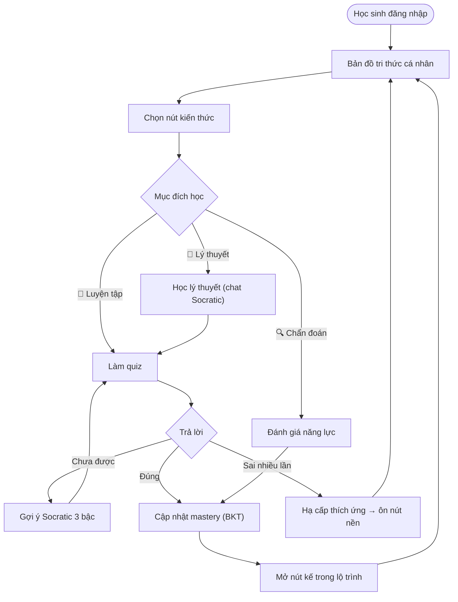
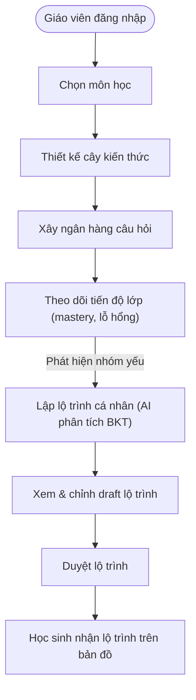

# Sơ đồ Workflow (tính năng chính) — Aurora "Chắc Gốc"

Bản rút gọn chỉ tập trung **vòng giá trị cốt lõi** của sản phẩm: bản đồ tri thức → học Socratic thích ứng → lộ trình cá nhân. Các tính năng phụ trợ được lược bỏ (xem [mục cuối](#tính-năng-phụ-đã-lược-bỏ)).

> Xem bản vẽ: mở bằng VS Code (extension *Markdown Preview Mermaid Support*), GitHub, hoặc [mermaid.live](https://mermaid.live).

---

## 🎓 Luồng Học sinh — vòng học thích ứng

---

## 👩‍🏫 Luồng Giáo viên — thiết kế & cá nhân hóa

**Điểm nối 2 luồng:** lộ trình giáo viên *Duyệt* (bước H) chính là "lộ trình" học sinh đi theo trên bản đồ tri thức (bước K/B luồng học sinh).

---

## Tính năng phụ đã lược bỏ

| Luồng | Đã bỏ khỏi sơ đồ |
|-------|------------------|
| Học sinh | Trang chủ marketing; chi tiết đăng nhập (demo/form); khôi phục UI từ localStorage; gauge workspace; chat theo từng câu hỏi |
| Giáo viên | Tạo đề kiểm tra; Chấm bài; import Excel câu hỏi; gắn tag/rubric; tạo môn mới; chi tiết biểu đồ pie/scatter giám sát |

---

## Phụ lục — điểm kỹ thuật cần lưu ý (không thuộc sơ đồ tính năng)

Các lỗ hổng phát hiện qua audit code, giữ lại để tham chiếu khi cải thiện:

| Luồng | Vấn đề | Vị trí |
|-------|--------|--------|
| Học sinh | Gauge "Độ thông thạo / Độ tự tin (BKT)" là số hardcode, hiển thị như đo thật | `frontend/src/app/tutor/page.tsx:439-453,1281-1366` |
| Học sinh | Chat Socratic stateless — prompt chỉ nhận `(history, topic, mode)`, không biết mastery | `backend/internal/service/ai_service.go:104-145`; `tutor_service.go:211-214` |
| Học sinh | Lỗi first-load bị nuốt (`console.error`), kẹt "Đang tải..." khi mạng chập | `frontend/src/app/tutor/page.tsx:228-287` |
| Giáo viên | "Xem chi tiết học sinh" gọi route chưa đăng ký → 404 nuốt → mastery trống | route thiếu `backend/cmd/server/main.go:205-324`; handler orphan `tutor.go:766` |
| Giáo viên | Scatter "Độ thông thạo Kỳ vọng" + cờ Outlier bịa từ hash tên học sinh | `backend/internal/service/tutor_service.go:1604-1612` |
| Giáo viên | Guardrail: backend + endpoint đủ, dashboard 0 UI | Endpoints `main.go:318-319`, handler `tutor.go:850-879` |
| Giáo viên | Port mismatch `GO_BACKEND_GRAPH_URL` (8082 vs 8081) → lộ trình dùng `graph.json` tĩnh | `learning-path/src/learning_path/api.py:72` |

_Backlog cải thiện chi tiết (P0/P1/P2): xem plan file `h-y-c-folder-knowledge-graph-misty-quasar.md`._
