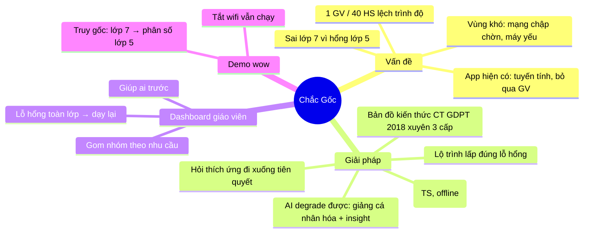
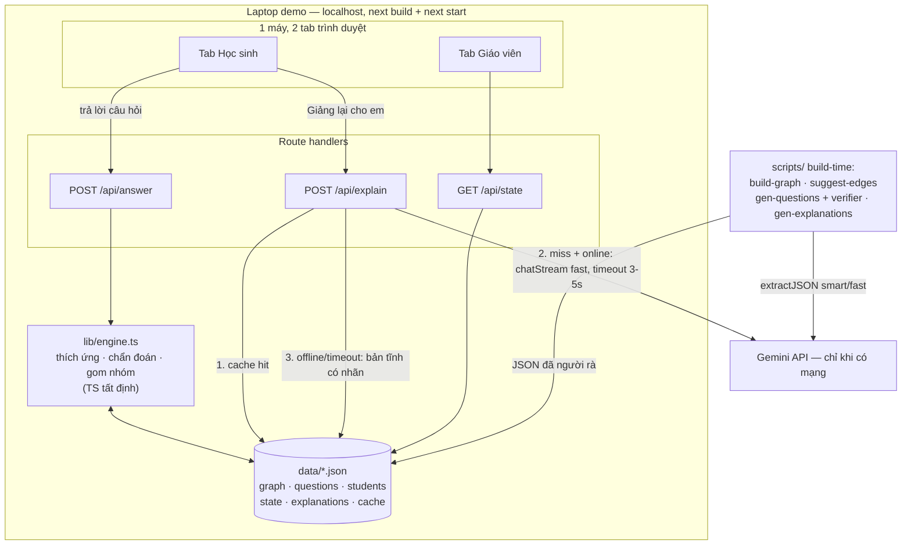

# SPEC — Chắc Gốc: gia sư thích ứng chẩn đoán lỗ hổng gốc rễ cho lớp học trình độ lệch

> SPEC là NGUỒN CHÂN LÝ: ngoài SPEC = không build.

## 1. Vấn đề

Giáo viên phổ thông Việt Nam — nặng nhất ở vùng khó khăn — đứng lớp **40 học sinh** với nền tảng rất khác nhau: tiết học 45 phút chia đều chỉ còn **~1 phút/học sinh** (ước đoán số học), không thể cá nhân hóa bằng sức người. Học sinh yếu sai bài lớp 7 thường vì hổng kiến thức từ lớp 5 (ví dụ nguyên văn của đề: hổng phân số), nhưng không ai truy ra được gốc rễ đó — app học hiện có chỉ đẩy bài theo thứ tự cố định và chấm đúng/sai. Hệ quả: em yếu mất gốc thêm, em giỏi bị kìm lại, giáo viên không biết nên giúp ai trước.

## 2. Người dùng & tình huống

Người dùng CHÍNH của demo: **cô Lan — giáo viên Toán THCS ở một trường vùng khó**, dùng laptop cấu hình thấp của trường, mạng chập chờn. Cô dùng app vào đầu tuần để giao bài chẩn đoán, và trước mỗi tiết để xem nên dạy lại gì, kèm ai trước. Vai phụ trong demo: **em Minh — học sinh lớp 7** làm bài ngay trên cùng laptop đó, ở tab trình duyệt thứ hai — **demo dùng 1 máy duy nhất, 2 tab** (quyết định sau /20-phanbien: mỗi máy/mạng thêm vào là một điểm hỏng thêm vào).

## 3. Giải pháp & khoảnh khắc WOW

Chắc Gốc chẩn đoán lỗ hổng kiến thức bằng cách hỏi thích ứng *đi xuống* theo bản đồ kiến thức tiên quyết bám CT GDPT 2018 (xuyên 3 cấp: tiểu học → THCS → THPT), rồi sinh lộ trình luyện tập lấp đúng node bị hổng thay vì chỉ báo đúng/sai. Toàn bộ vòng lặp học sinh (làm bài → chấm → chẩn đoán → bài kế tiếp) chạy tất định trên dữ liệu tĩnh — không cần mạng; AI (Gemini) chỉ thêm lớp "wow" có thể degrade: lời giảng cá nhân hóa và insight cho giáo viên. Dashboard giáo viên tự động gom nhóm học sinh, xếp ưu tiên "giúp ai trước" và chỉ ra lỗ hổng toàn lớp cần dạy lại.

**Khoảnh khắc wow của demo là khi** em Minh sai câu số hữu tỉ lớp 7 và hệ thống hiện chuỗi truy ngược trên bản đồ kiến thức: "Gốc rễ: quy đồng phân số (lớp 5)" kèm lộ trình lấp lỗ — **ngay sau khi vừa tắt wifi**.

## 4. Golden path (luồng demo duy nhất)

1. Cô Lan mở app trên laptop (`next build && next start`, localhost), thấy lớp 7A (40 học sinh seed sẵn), bấm giao "Bài chẩn đoán: Số hữu tỉ".
2. (Tab học sinh, cùng máy) Em Minh làm bài chẩn đoán ~8 câu trắc nghiệm; sai câu lớp 7 → hệ thống tự hỏi xuống kiến thức tiên quyết (lớp 6, rồi lớp 5) để khoanh vùng.
3. Nộp bài → **màn hình wow chính**: bản đồ kiến thức tô màu chuỗi truy ngược, kết luận "Gốc rễ: Quy đồng mẫu số — Phân số (lớp 5)" + **cảnh báo chiều xuôi** ("Không lấp lỗ này → sẽ vướng Phương trình (lớp 8), Hàm số (lớp 10), tới tận Đạo hàm (lớp 11), Tích phân (lớp 12)") + lộ trình lấp lỗ.
4. Minh bấm "Giảng lại cho em" **khi còn mạng**: Gemini stream lời giảng bám đúng phương án sai em vừa chọn — khoảnh khắc AI live duy nhất của demo.
5. **Tắt wifi (đúng 1 lần, không bật lại).** Minh luyện bài đầu tiên trong lộ trình, đúng → node chuyển màu; bấm "Giảng lại" lần nữa → lời giảng tĩnh có nhãn "bản offline" — degrade diễn ra trước mắt giám khảo.
6. (Tab giáo viên, vẫn offline) Dashboard lớp 7A: 3 nhóm học sinh theo nhu cầu, danh sách "giúp ai trước hôm nay", biểu đồ lỗ hổng toàn lớp "12/40 em hổng Phân số (lớp 5) → gợi ý dạy lại 15 phút đầu giờ" — **có phản ánh bài Minh vừa nộp**.
7. Một dòng insight cho cô Lan (bản do Gemini soạn trước + kiểm số, có nhãn; offline vẫn hiện) — kết demo.

## 5. Phạm vi 48h

**LÀM:**
- Đúng golden path trên, không hơn.
- Bản đồ kiến thức 1 mạch Toán dọc xuyên 3 cấp, **hiển thị 38 node** (chốt sau rà soát cuối 17/7): **24 node thật** (có ngân hàng câu hỏi) = nền móng lớp 4 (Nhân-chia, Biểu thức chữ) → mạch phân số/số hữu tỉ 4–7 (gồm ƯC–BC & luỹ thừa lớp 6) → đại số bản lề 7–8 (Biểu thức, Đa thức 1 & nhiều biến, Hằng đẳng thức, Phân thức, PT bậc nhất); **14 node mờ** = hiển thị + cạnh nhưng CHƯA kích hoạt nội dung (không câu hỏi, không lời giảng) — toàn bộ lớp 9–12 và vài node khái niệm lớp 6–7 (Số nguyên âm, Căn bậc hai, Số thực). Kích hoạt node mờ = đổi cờ `mo` + sinh câu hỏi, không đổi engine/UI. Mỗi node thật gắn nguyên văn yêu-cầu-cần-đạt CT GDPT 2018. **Tọa độ node viết cứng trong JSON** (cột = khối lớp) — không auto-layout.
- Ngân hàng câu hỏi tĩnh: **4–6 câu/node × 24 node ≈ 95–145 câu**, sinh trước bằng Gemini; **verifier TS tất định tính lại đáp án + loại nhiễu trùng đáp án TRƯỚC**, người rà 100% SAU (chia cho đội — lý do mở gói P1); lưu JSON trong repo. 3 node trên chuỗi chẩn đoán của kịch bản có thêm câu dự phòng.
- Cạnh tiên quyết: LLM đề xuất qua schema **enum node-id đóng** + kèm trích YCCĐ làm căn cứ, người rà 100% (~40–80 cạnh); **riêng chuỗi demo L7 → L6 → L5 soạn tay**.
- Engine TS tất định, **rule đơn giản đúng cho 1 mạch — không graph engine tổng quát**: chọn câu thích ứng đi xuống, luật ≥2 bằng chứng mới kết luận hổng, lộ trình rule-based, gom nhóm = ngưỡng hóa mastery chạy lúc render (để dashboard phản ánh bài Minh vừa nộp).
- 2 trang (1 laptop, 2 tab): trang học sinh (làm bài + bản đồ + lộ trình) và dashboard giáo viên; biểu đồ SVG thuần. **State = file JSON ghi qua route handler** — sống qua restart, offline tuyệt đối.
- Lớp AI: **1 call LLM sống duy nhất trong demo** ("Giảng lại cho em", `chatStream`, prompt = diễn giải lời giải đã duyệt + phương án sai em chọn, CẤM tự tính ví dụ mới; timeout cứng 3–5s bằng AbortController + timeout theo chunk + fallback tĩnh có nhãn; cache theo (node, phương án sai), làm ấm trước demo). Insight giáo viên sinh TRƯỚC bằng `extractJSON` + kiểm mọi chữ số phải có trong input, demo phát bản đã duyệt.
- Seed 40 học sinh lớp 7A = **mastery theo node** (không lịch sử từng câu) tạo 3 nhóm rõ.

**KHÔNG LÀM (cắt thẳng tay):**
- Đăng nhập / phân quyền thật (chọn vai bằng 1 nút).
- Môn khác ngoài Toán; phủ toàn bộ chương trình (chỉ 1 mạch dọc).
- Sinh câu hỏi bằng LLM lúc runtime; insight sinh live lúc demo.
- **Deploy Vercel trước khi nộp** (mâu thuẫn state file + mời rủi ro rate limit từ khán giả; nếu làm thì sau khi nộp, ngoài đường găng).
- **Demo 2 máy** (tắt wifi là mất liên lạc giữa 2 máy — bất khả thi như kịch bản cũ).
- Auto-layout DAG; pan/zoom bản đồ; lịch sử làm bài chi tiết của 40 em seed.
- Mobile app, PWA/service-worker (app chạy localhost trên laptop là đủ ràng buộc offline).
- Chat tự do với gia sư; quản lý nhiều lớp; xuất báo cáo; gamification; sync đám mây; LLM local (Ollama).

## 6. Dữ liệu demo

- **Bản đồ kiến thức**: đội tự soạn từ văn bản CT GDPT 2018 môn Toán (Thông tư 32/2018 — công khai), Claude soạn nháp + người rà, JSON tĩnh.
- **Ngân hàng câu hỏi**: sinh trước bằng `extractJSON` theo từng node (đáp án + nhiễu + giải thích), người rà từng câu trước demo, JSON tĩnh tiếng Việt.
- **Học sinh**: 40 em lớp 7A, tên tiếng Việt thật-như-thật (giả lập, KHÔNG PII thật), kèm lịch sử làm bài seed tạo phân bố lệch trình độ (giỏi/trung bình/mất gốc) để dashboard có 3 nhóm rõ.
- **Lời giảng tĩnh dự phòng**: 1 đoạn/node, soạn trước, dùng khi offline.

## 7. Rủi ro & giảm nhẹ

- Đáp án sai nhưng JSON hợp lệ (schema-valid ≠ toán đúng) → verifier TS tính lại đáp án, loại nhiễu trùng đáp án, chạy TRƯỚC người rà; người rà 100% câu còn lại.
- Cạnh tiên quyết LLM đề xuất sai sư phạm → schema enum node-id đóng (không bịa node được) + mỗi cạnh kèm trích YCCĐ + người rà 100% cạnh; chuỗi demo soạn tay, không nhận từ LLM.
- Fetch treo 20–75s khi vừa tắt wifi (nút đứng hình trên sân khấu) → AbortController timeout 3–5s + timeout theo chunk cho stream; fallback tĩnh có nhãn; tổng duyệt ít nhất 1 lần với wifi TẮT THẬT trên đúng laptop demo.
- Hết rate limit / key lộ → nội dung sinh build-time; cache lời giảng làm ấm trước demo (lượt demo thật tốn ~0 quota); key Gemini thứ 2 từ account khác, đổi trong 10 giây.
- Process crash / lỡ restart giữa demo → state = file JSON (sống qua restart); script khởi động 1 lệnh; video quay trọn golden path để trên điện thoại + USB làm phao cuối.
- Chạy nhầm `next dev` (compile-on-demand hàng chục giây trên máy yếu) → demo bằng `next build && next start`; audit tab Network lúc offline để bắt font/CDN/ảnh remote lọt vào build.
- Chẩn đoán sai vì ít bằng chứng → luật ≥2 câu sai cùng node mới kết luận hổng; demo bằng kịch bản đã tập đúng từng phương án sai Minh sẽ chọn (chuỗi truy ngược là kết quả biết trước).
- Demo 3 cấp bị loãng → 1 nhân vật chính (Minh, lớp 7); tính xuyên cấp thể hiện bằng bản đồ truy về lớp 5 + cảnh báo chiều xuôi lên lớp 8–10.
- Giám khảo hỏi "AI ở đâu?" → trả lời chuẩn bị sẵn trong pitch: AI là nhà máy nội dung build-time (60–90 câu + cạnh đề xuất + lời giảng, đều có người duyệt) + 1 điểm AI live có degrade — kiến trúc đúng cho lớp học vùng khó, đó là lựa chọn chứ không phải thiếu sót.
- Đường găng nội dung nuốt quỹ giờ → mốc đóng băng: graph xong giờ thứ 8 · nội dung xong giờ 24 · feature freeze giờ 32 · 8h cuối chỉ tích hợp + tổng duyệt + DEMO.md.
- Laptop yếu → SVG thuần (`lib/chart.ts`), không lib chart nặng, dữ liệu nhỏ, không animation.

## Mindmap

## MVP chốt (sau /20-phanbien)

**MVP = golden path mục 4 (bản đã sửa theo phản biện) + đúng 1 tính năng phụ:** cảnh báo chiều xuôi trên màn hình chẩn đoán ("Không lấp lỗ này → vướng Phương trình lớp 8, Hàm số lớp 10") — dùng chính dữ liệu graph, ~0 code thêm, vá đồng thời 2 điểm yếu: "phủ 3 cấp" đang mỏng và đèn wow rọi nhầm vào màn tắt wifi.

**4 vai đồng thuận tuyệt đối ở một điểm: đường găng là NỘI DUNG, không phải code.** PM ước tổng khối lượng SPEC cũ = 95–135 giờ-người trên quỹ ~110–130 (buffer 0); PO ước riêng rà 300+ câu ≈ 25 giờ. SPEC này đã cắt theo.

**Danh sách CẮT + lý do:**
1. Bản đồ 30–50 node → hiển thị ~20–25, chỉ 12–15 node mạch demo có nội dung đầy đủ, lớp 8–12 thành node mờ (tiết kiệm ~20–30 giờ-người dây chuyền node→câu→rà→giảng).
2. Ngân hàng 150–500 câu → 60–90 câu, verifier tất định chạy trước, người rà 100% sau.
3. Lời giảng tĩnh: chỉ soạn cho node có câu hỏi.
4. Lịch sử làm bài chi tiết 40 em → seed thẳng mastery theo node.
5. Graph engine tổng quát → rule đơn giản đúng cho 1 mạch; gom nhóm = ngưỡng hóa lúc render.
6. Auto-layout SVG map → tọa độ viết cứng theo cột khối lớp.
7. Deploy Vercel → ra khỏi đường demo (localhost `next build && next start` là môi trường chấm).
8. Kịch bản 2 máy → 1 laptop 2 tab; state = file JSON qua route handler.
9. Insight giáo viên sinh live → sinh trước + kiểm số + phát bản đã duyệt; AI live duy nhất = "Giảng lại cho em" (đặt TRƯỚC màn tắt wifi, degrade thấy được ngay sau đó).

**Mâu thuẫn đã phân xử:** kích thước bản đồ (PO 20–25 / PM 12–18 / AI-Eng vẽ nhiều-hỏi ít → chốt: vẽ 20–25, hỏi 12–15); vai trò màn tắt wifi (PO đòi hạ / DevOps giữ → chốt: giữ, đúng 1 lần, không bật lại, AI live diễn ra trước khi tắt); insight live vs cache (chốt: cache); gom nhóm precompute (PM) vs runtime (chốt: TS lúc render vì dashboard phải phản ánh bài Minh vừa nộp — nhưng chỉ là ngưỡng hóa, không thuật toán).

**Cập nhật 17/7 (sau khi đội bổ sung nhân lực):** mở rộng **gói P1 — đại số bản lề lớp 7–8**: +4 node thật (Biểu thức đại số, Đa thức một biến L7; Hằng đẳng thức, Phân thức đại số L8) + nâng PT bậc nhất mờ→thật ⇒ 28 node / 19 thật / 46 cạnh, ngân hàng ~80–115 câu. Lý do chọn lớp 7–8: fan-in/fan-out cao nhất mạch đại số (L7 = nơi toàn bộ số học 4–6 hội tụ rồi chuyển sang chữ; L8 = bộ kỹ thuật biến đổi nuôi lớp 9–12). Bổ sung cùng ngày: +2 node **nền móng lớp 4** (Nhân-chia số tự nhiên — gốc của quy đồng & số nguyên; Biểu thức số & biểu thức chữ — mầm đại số CT 2018, tổ tiên trực tiếp của Biểu thức đại số L7) ⇒ chốt **30 node / 21 thật / 50 cạnh**, ~85–125 câu. Không thêm lớp 3 (chỉ "làm quen" phân số, không cần cho chuỗi chẩn đoán). **Rà soát cuối cùng 17/7 (chốt bước 1):** vá 3 chỗ gãy mạch — ƯC–BC lớp 6 (YCCĐ nói thẳng "cộng trừ phân số bằng ƯCLN/BCNN"), Luỹ thừa lớp 6 (→ luỹ thừa số hữu tỉ L7 → hàm mũ L11), Đa thức nhiều biến lớp 8 (khe giữa đa thức 1 biến và hằng đẳng thức) — cả 3 là node thật; thêm 5 node mờ khái niệm (Số nguyên âm L6, Căn bậc hai + Số thực L7, Căn thức + Hàm y=ax² L9). Bỏ có chủ đích: cấu tạo thập phân L4, so sánh/làm tròn thập phân L5, ôn tập số tự nhiên L5 (trùng/không nuôi node nào), mệnh đề–tập hợp/bất PT/tổ hợp L10 (nhánh khác). **Chốt bước 1: 38 node / 24 thật / 64 cạnh.** Chuỗi demo và kịch bản KHÔNG đổi.

**Rủi ro lớn nhất còn lại + cách chặn:** nội dung toán sai lọt lên màn chiếu (đáp án sai schema-valid, cạnh tiên quyết sai). Chặn bằng 4 lớp: verifier tất định → enum đóng + trích YCCĐ cho cạnh → người rà 100% (cạnh + câu) → chuỗi demo soạn tay & tập trước từng phương án sai. Mốc đóng băng: graph giờ 8 · nội dung giờ 24 · feature giờ 32. **Definition of done demo (DevOps):** chạy trọn golden path với wifi tắt từ đầu đến cuối, `next build && next start`, restart process giữa chừng mà dashboard vẫn còn dữ liệu.

## Kiến trúc (sau /30-stack)

### Quyết định stack

**Stack mặc định của kit là ĐỦ — không cài thêm package nào.** Next.js 16 (App Router) + TypeScript + Tailwind 4 + Gemini qua `lib/llm.ts` + zod (đã có). Lý do từng thứ KHÔNG cần:
- ~~recharts~~ → biểu đồ dashboard dùng SVG thuần theo pattern `lib/chart.ts` (nhẹ cho laptop yếu, không thêm bundle).
- ~~react-leaflet / lib graph~~ → bản đồ kiến thức là SVG tự vẽ với **tọa độ node viết cứng trong JSON** (đã chốt ở MVP: không auto-layout).
- ~~Drizzle + Neon / DB~~ → state = **file JSON ghi qua route handler** (`node:fs`, ghi atomic); môi trường chấm là localhost nên filesystem bền vững, sống qua restart, offline tuyệt đối. DB cloud còn phản tác dụng (chết khi tắt wifi).
- Deploy: **`next build && next start` trên laptop demo** — Vercel ngoài đường găng (đã chốt ở MVP).

Route có sẵn của kit (`/api/chat`, `/api/extract`, `/api/upload`, `/api/agent`, `/api/pipeline`) **không nằm trong golden path** — luồng chính không dùng LLM, còn điểm LLM live duy nhất cần cache + fallback + timeout riêng nên tách route mỏng. Giữ nguyên các route cũ, không xóa.

**File mới sẽ dựng** (không đụng `lib/llm.ts`):
- `lib/engine.ts` — engine tất định: chọn câu thích ứng đi xuống, luật ≥2 bằng chứng, chẩn đoán truy graph, cảnh báo chiều xuôi, lộ trình rule-based, gom nhóm ngưỡng hóa. Thuần TS, test headless được.
- `lib/store.ts` — đọc/ghi `data/state.json` (atomic write, tuần tự hóa ghi để 2 tab không giẫm nhau).
- `data/graph.json` · `data/questions.json` · `data/explanations.json` (lời giảng tĩnh + insight đã duyệt) · `data/students.json` (seed 40 em) · `data/explain-cache.json`.
- Routes mới: `POST /api/answer` · `GET /api/state` · `POST /api/explain`.
- Scripts build-time (chạy `npx tsx`, nạp key thủ công — bẫy #8 FIELD-NOTES): `build-graph.ts` (parse knowledge_base → JSON, tất định) · `suggest-edges.ts` · `gen-questions.ts` (kèm **verifier tất định**) · `gen-explanations.ts` · `check-graph.ts` · `check-engine.ts`.

### Bảng map: bước golden path → hàm → route → model

| Bước | Việc | Hàm `lib/llm.ts` | Route | Model |
|---|---|---|---|---|
| Build-time | Parse YCCĐ → node graph | — (script tất định) | — | — |
| Build-time | Đề xuất cạnh tiên quyết (enum đóng + trích YCCĐ) | `extractJSON` | — (script) | `smart` (suy luận sư phạm, chạy ~1 lần) |
| Build-time | Sinh 60–90 câu hỏi → verifier → người rà | `extractJSON` (think HIGH, temp 0) | — (script) | `fast` |
| Build-time | Lời giảng tĩnh + insight GV (kiểm chữ số) | `extractJSON` | — (script) | `fast` |
| 1. Giao bài | Ghi assignment vào state | — | `GET/POST /api/state` | — |
| 2. Quiz thích ứng | Chấm + chọn câu kế (đi xuống tiên quyết) | — (`lib/engine.ts`) | `POST /api/answer` | — |
| 3. Chẩn đoán + chiều xuôi | Truy graph, tô màu chuỗi | — (`lib/engine.ts`) | `GET /api/state` | — |
| 4. "Giảng lại cho em" (AI live duy nhất) | Cache → live stream → fallback tĩnh | `chatStream` (timeout 3–5s AbortController + timeout theo chunk) | `POST /api/explain` | `fast` |
| 5. Luyện tập (đã tắt wifi) | Như bước 2 | — | `POST /api/answer` | — |
| 6. Dashboard GV | Gom nhóm, ưu tiên, biểu đồ SVG | — (`lib/engine.ts` + pattern `lib/chart.ts`) | `GET /api/state` | — |
| 7. Insight GV | Đọc bản sinh trước đã duyệt | — (đọc `data/explanations.json`) | `GET /api/state` | — |

### Flowchart

### Rủi ro kỹ thuật

- **Rate limit free tier lúc demo** → runtime chỉ 1 loại call, cache làm ấm trước = lượt demo tốn ~0 quota; build-time sinh câu chạy sớm (ngày 1), key thứ 2 dự phòng đổi trong 10 giây.
- **Thời gian phản hồi** → luồng chính 0 LLM = tức thời; `/api/explain` stream chunk đầu ~1–2s, quá 3–5s là AbortController cắt → fallback tĩnh, không bao giờ đứng hình.
- **Kích thước file upload** → golden path KHÔNG có upload; rủi ro này không áp dụng (route `/api/upload` cũ không dùng).
- **Wifi hội trường** → toàn luồng offline trừ đúng 1 điểm đã có fallback; kịch bản chủ động tắt wifi; audit tab Network lúc offline để bắt font/CDN lọt build.
- **2 tab ghi state đồng thời** → mọi ghi đi qua `lib/store.ts` tuần tự hóa + atomic write (ghi file tạm rồi rename), tránh state.json vỡ giữa demo.
- **Windows encoding/console** → file JSON ghi UTF-8 explicit; script build-time tránh echo tiếng Việt ra console cp1252 (bẫy đã ghi ở `py/README.md` áp dụng chung).
